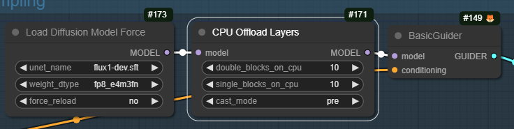

# Flux CPU Offload
 
Keep some FLUX layers in RAM until needed.

## What does it do?

Flux (like a number of newer models) is built from a set of transformer layers. The latent gets passed through each layer in turn,
being 'transformed' as it goes. Each layer has a very large number of parameters which are normally stored in VRAM for quick use.

This node takes some of those layers, and pins (some of) their parameters on the CPU. They are transferred to the GPU only when needed.

Transferring them takes time, so this is a bit slower, and it requires more RAM but it frees up a lot of VRAM.

## How do I try it?

Install by going to your custom nodes directory and typing
```
git pull https://github.com/ChrisGoringe/flux_cpu_offload
```

To update, go into the `flux_cpu_offload` folder and type `git pull`

## Workflow?

Just pass your model through the node like this:



## What are the settings?

### xxx_blocks_on_cpu

The flux model has 19 `double block layers` and 38 `single block layers`. You can choose how many of each to offload. Roughly speaking, offloading a double block layer saves twice as much VRAM.

### cast_mode

If the model was loaded in one of the `bfloat8` types, the parameters are converted to `bfloat16` to be used. This setting controls how and when they are converted.

- `pre` stores the parameters on the cpu in `bfloat16`. This takes twice as much RAM but means they don't need to be cast when used, so it's faster.
- `auto` stores the parameters as loaded, and uses autocast. Use this if you find you run out of RAM with `pre`.


## Error: 'OnDemandLinear' object has no attribute 'weight'

At the moment if you change the settings you might well get this error, because it's trying to modify an already modified model. 
If you use the `"Load Diffusion Model Force` node to load you can set it to force a reload which should fix it (but set it back to `no` if
you aren't changing things, or you'll be reloading the model every time!)

## Does it change the image

It shouldn't. If it does, please let me know!

## Does it work with LoRAs? 

Yes, it seems to. 